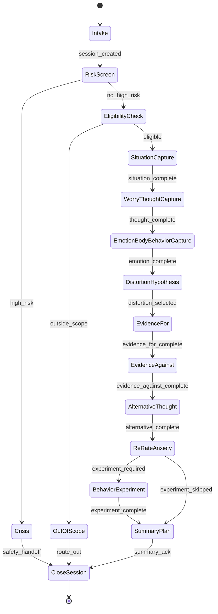

# GAD CBT Engine Specification

## Engine overview

This product is a structured CBT support engine for adults with generalized anxiety disorder (GAD). It is designed as a rules-driven software workflow, not as a free-form counseling bot. The engine captures worry records, structures them into CBT slots, routes users through a fixed cognitive restructuring flow, and interrupts that flow when safety risk is detected.

## Intended use

- Support adults with GAD in documenting structured CBT worry records.
- Guide users through situation, worry prediction, automatic thought, emotion, body response, behavior, evidence, alternative thought, and behavior experiment steps.
- Escalate to safety guidance when self-harm, suicide, psychotic-like expression, or acute deterioration signals are detected.

## Out of scope

- Diagnostic classification or disease screening.
- Delusion or psychosis diagnosis.
- Independent suicide risk determination by ML/LLM.
- Free-form therapy judgment, treatment planning, or medication advice.
- Brand concepts or persona styling in clinical logic.

## State model

## State contract summary

| State | Required inputs | Produced outputs | Exit condition |
| --- | --- | --- | --- |
| `risk_screen` | risk checklist or free text | `RiskAssessment` | high risk or checklist completion |
| `eligibility_check` | adult status, target condition, exclusion flags | eligibility disposition | in-scope or out-of-scope determination |
| `situation_capture` | situation text, trigger text | structured situation artifact | both fields present |
| `worry_thought_capture` | automatic thought, worry prediction | structured worry artifact | both fields present |
| `emotion_body_behavior_capture` | emotion list, intensity, body symptoms or safety behaviors | emotional response artifact | emotions present and one behavior/body signal present |
| `distortion_hypothesis` | prior thought data | distortion candidates and rule matches | user accepts selection or chooses none |
| `evidence_for` | supporting evidence list | evidence-for artifact | one or more entries |
| `evidence_against` | counter evidence list | evidence-against artifact | one or more entries |
| `alternative_thought` | balanced view, coping statement | template-composed alternative thought | both fields present |
| `re_rate_anxiety` | re-rated anxiety intensity, experiment choice | delta score artifact | score present |
| `behavior_experiment` | experiment action and timebox | behavior experiment artifact | both fields present |
| `summary_plan` | acknowledgment | summary artifact | acknowledgment accepted |

## Safety design

- Risk review is evaluated at session start and before every state transition.
- High-risk detections immediately interrupt normal flow and move the session to `crisis`.
- Risk rules are deterministic and based on checklist responses plus static phrase matching.
- Audit logs are append-only and capture payload hash, matched rules, state transition, version manifest, and template IDs.

## Versioning

The engine persists and returns these version identifiers on every response:

- `engine_version`
- `protocol_version`
- `rule_set_version`
- `template_bundle_version`
- `risk_rules_version`

## MVP scope

- Adult GAD only.
- Single-session cognitive restructuring flow.
- SQLite persistence.
- FastAPI HTTP API.
- Deterministic distortion proposal rules.
- No LLM required for core behavior.
